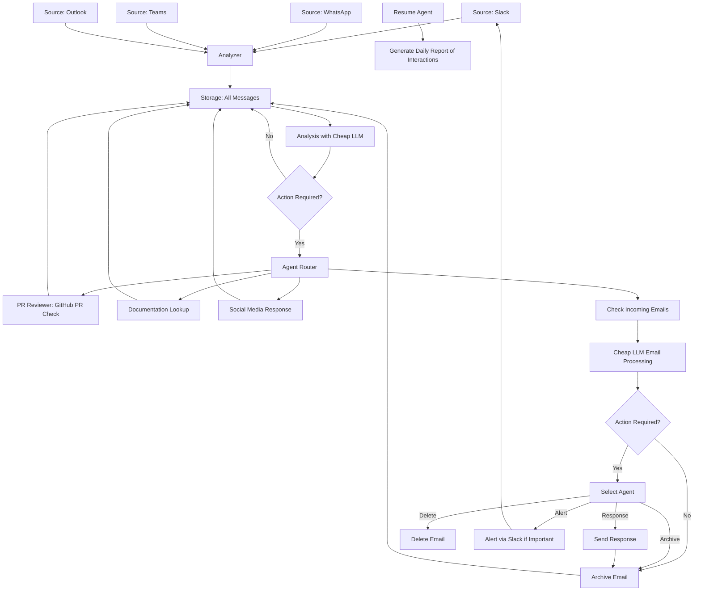

# Jaicob

Replacing myself with ai.

There are a lot of communication channels, useful but also distracting.
I want to see how far i can come by automatic myself using ai agents/bots. 
For example somebody asks a PR review, 

## Data Channels


### Text Interaction

* Slack
* Whatsapp
* Teams Chat

Optional

* Signal

### Email

* Gmail
* Office365

### Video (audio)

This might be harder.

* Teams
* Slack
* Zoom
* Whatsapp

### News gathering

* hacker news
* rss
* slack channels


## How ?

This is a great project to start with LLM agents running on Python.
I'm a aws cloud architect, so some aws, cloudflare an what more.

Let's start with [Slack](./slack/)

First test works, i can write message as me. So now i need to get all the messages from all channels and 
then build some logic to decide when to ask

```python
    response = client.chat_postMessage(
            channel="xxxxxx",  # Replace with the channel ID
            text="Hello from the bot acting as me!",
            as_user=True  
        )
```

## Next steps

* Build public callback infra
* save messages into rag?
* cheap llm or regex to analyse the message and see when needs to act
* write some "agents" to do my tasks
* * Pr Review
* * general questions.
* * * Need rag/cag with documentation and code (how to keep that up2date)


## Design


